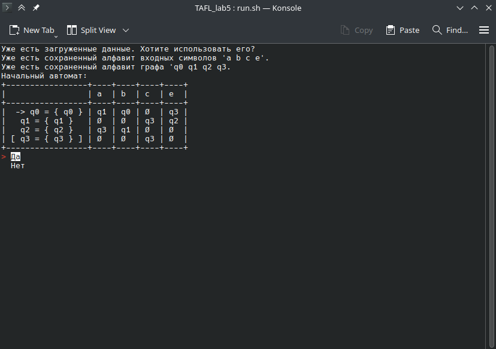
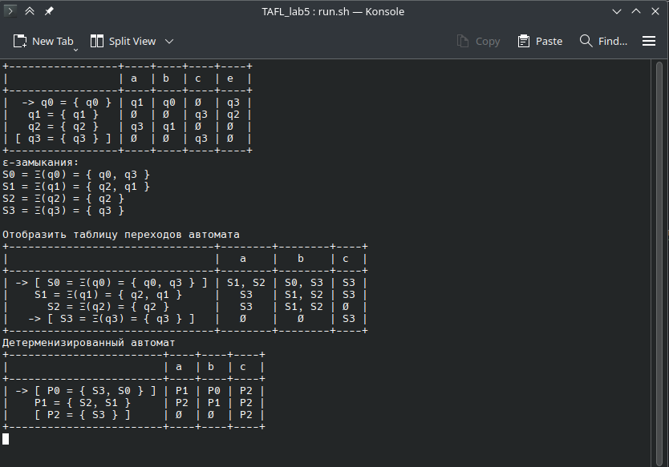
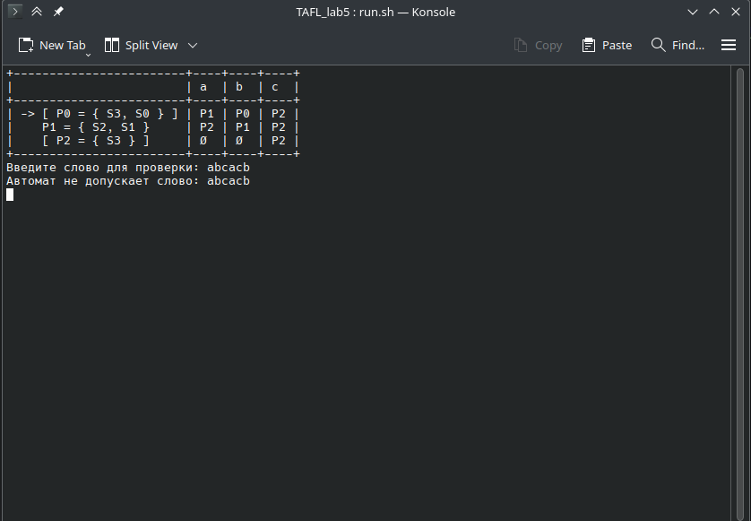

# Что за проект (RU)

Данный проект был создан, как лабораторная работа для университета по предмету "Теория автоматов и формальных языков".

Данный проект выполняет следующие пункты:

- Построить ε-замыкания 
- Отобразить таблицу переходов автомата 
- Строим детерминированный автомат 
- Проверяем пользовательское слово

# Зависимости

Установка `pip install -r requirements.txt`

Есть только необязательная зависимость `simple_term_menu` и служит только для красивого отображения меню. Работает только в Linux и только в терминале.

Если у вас другой случай, то будет работать более простое меню

# Запуск

`python main.py`

# Скриншоты

## Загрузка предыдущего состояния

### Linux

### Windows

## Основное задание

### Linux

### Windows

## Проверка допустимого слова

### Linux

### Windows

# What kind of project (ENG)

This project was created as a laboratory work for the university on the subject "Theory of automata and formal languages".

This project fulfills the following points:

- Build the ε-closures 
- Display the transition table of the machine 
- We are building a deterministic automaton 
- Checking the user word

# Dependencies

Installing `pip install -r requirements.txt `

There is only an optional dependency `simple_term_menu` and only serves to display the menu beautifully. It works only on Linux and only in the terminal.

If you have a different case, then a simpler menu will work.

# Launch

`python main.py`

# Screenshots

## Loading the previous state

### Linux

### Windows

## The main task

### Linux

### Windows

## Valid word check

### Linux

### Windows
